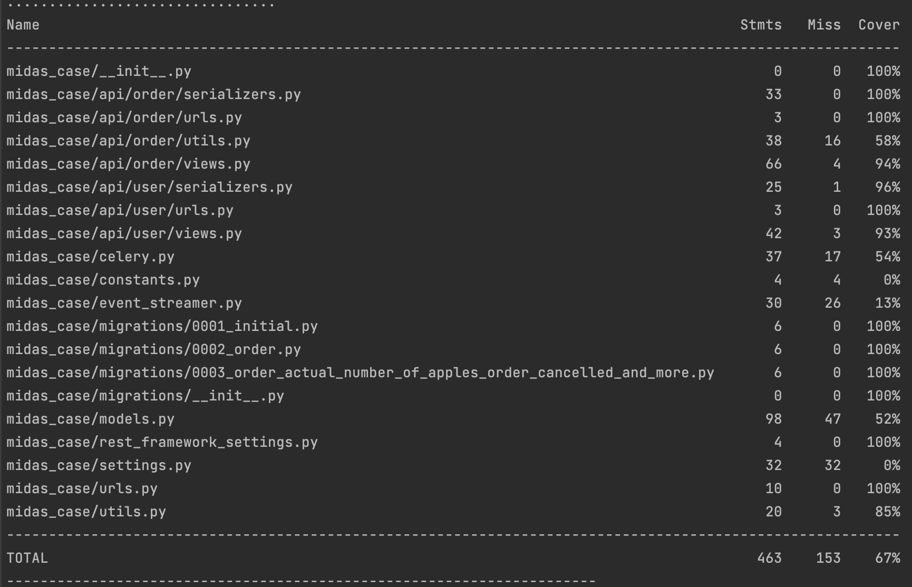

# All in one

How to test this?

1. [Install Docker Compose](https://docs.docker.com/compose/install/)
2. Clone this repository
3. Build all containers with `docker-compose build`
4. Run all containers with `docker-compose up`
5. Check [API Doc](http://0.0.0.0:8000/) to test

# Test coverage
